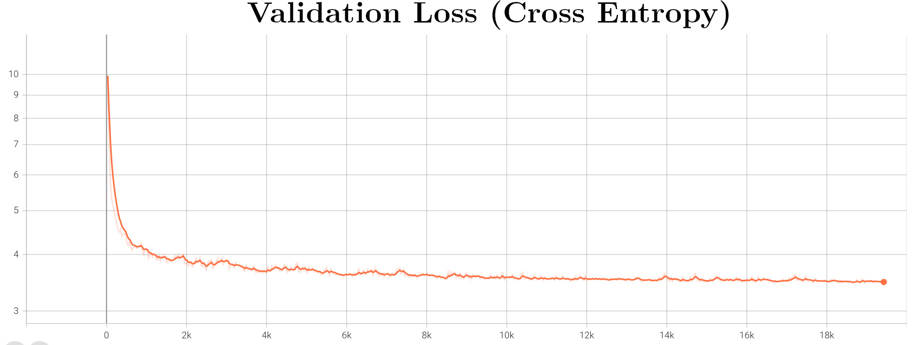

# xLSTM in Easy Pytorch

This repo contains the _unofficial_ implementation of `xLSTM` model as introduced in [Beck et al. (2024)](https://arxiv.org/abs/2405.04517). This repo is developed mainly for didactic purposes to spell out the details of a modern `Long-Short Term Memory` with competitive performances against modern `Transformers` or `State-Space` models (e.g. `Mamba`).

Just for fun, this repo tries to implement a basic LLM (see `📂 xlstm.llm`) using [Lightning](https://lightning.ai/docs/pytorch/stable/) so that training on multi-gpu (should) be just one variable away.

# Results

Just for fun I set up to train a small `xLSTM` LLM model on the cute `TinyStories` dataset and logged its progress as it learned (I always find it amusing to read the incoherent first attempts and was actually surprised by how quickly it got the general structure). Here what I get for the highly original `Once upon a time` prompt:

**At initialization**

```text
Once upon a timeboro wit carryingabellaastered Greens intestinal Pil su128 configure Patentrowing SeventhNohs implies Burger ® Cities lowacommTYelligimilationbender Manual authored Comprehensivelow fightingrinasq intercourse377 gradientafe bluntlyaroo coats Witchhiba Jeff Flags ambassadors iT deleted Deals reassCruzka...(you get the idea)
```

**After 320 steps**

```text
Once upon a time. She and took them. He is and they with something. She asked, a big dog on the park. Lily went to the park, ''That wanted it is not she is
verv hanov into the around's mom man was a lot him to the "Thank
he couldn't sad and. He is a time. "What and not to go be careful. She was that the little girl, I will. Then it?''' Tom things. He took it they saw a bia."
```



**After 20K steps**

```text
Once upon a time. Jack and ran across the hill. When she always a bit embarrassed and felt so much to play!" And they couldn't know what you should always made of the park." One day she wanted to help make some new friends."
"The boy was so happy to a time.
"Lily's help. He was very sorry, there. Then, and it looked at how he saw the ball. When she was happy and had so excited to buy the ground. He used to fly was very happy and daddy was so excited and the car. Timmy went to go home."
```

# Usage

The `xlstm` module exposes both the `sLSTM` (scalar-LSTM) and the `mLSTM` (matrix-LSTM) modules. Both expect their input to have shape `(batch_size, d_input)` as they consume an input sequence sequentially. They output the model current (projected) hidden state `h_t` (which is considered the module output and has the same shape as the input, see Figure 9 in the Appendix of [Beck et al. (2024)](https://arxiv.org/abs/2405.04517)), plus their updated hidden variables (a tuple of tensors).

```python
from xlstm import sLSTM
from itertools import pairwise

seq_len = 32
batch_size = 4

inp_dim = 16
head_dim = 8
head_num = 4

# Create a mock up input sequence
seq = torch.randn(seq_len, batch_size, inp_dim)

lstm = sLSTM(
    inp_dim,        # Input sequence dimension
    head_dim,       # Dimension of each head
    head_num,       # Number of heads
    p_factor=4/3,   # Tunable expansion factor
)

# Initialize the hidden states
hid = lstm.init_hidden(batch_size)

criterion = ... # Pick some loss function, i.e. MSE

# Iterate through the sequence length
loss = 0
for prev, succ in pairwise(seq):
    # Get the model prediction plus the updated hidden states
    pred, hid = lstm(prev, hid)

    # Target is the next sequence token
    loss += criterion(pred, succ)

# Compute gradients
loss.backward()
```

This repo also provides an implementation of an `xLSTM` LLM (which is simply a stack of `sLSTM`s and `mLSTM` plus a prediction head) built using `Pytorch Lightning` which unlocks easy training on multi-gpus. To use it one can simply run the following example:

```python
from lightning import Trainer
from transformers import AutoTokenizer

from xlstm import xLSTM
from xlstm.stories import TinyStoriesLightning

config = ... # path to YAML configuration file

# Load an off-the-shelf tokenizer from HF
tokenizer = AutoTokenizer.from_pretrained('openai-community/gpt2')

# Load the Mamba model from a config file
model = xLSTM.from_config(config, key='llm')

# Load the dataset
dataset = TinyStoriesLightning.from_config(
    config,
    tokenizer,
    key='dataset'
)

trainer = Trainer(
  max_epochs  = 500,
  accelerator = 'gpu',
  devices     = 4, # Piece of cake multi-gpu support!
  strategy    = 'ddp_find_unused_parameters_false',
)

# Train the model
trainer.fit(model, dataset)
```

Alternatively, one can also run the training script `run.py` directly which leverages the `LightningCLI` API which offers great flexibility for customization. The script expects a configuration file path (see example configuration file in `📂 config/llm.yaml`) and accepts all the Trainer arguments (and more! See [LightningCLI](https://lightning.ai/docs/pytorch/stable/api/lightning.pytorch.cli.LightningCLI.html#lightning.pytorch.cli.LightningCLI) for reference).

```bash
python run.py fit --config config/llm.yaml
```

A cool feature of `xLSTM` current implementation is the lazy (batched-) inference implemented via a generator. One can thus print tokens on screen as they are streamed by the model, no need to wait for the whole inference to finish! A mock-up script would look like the following.

```python
from xlstm import xLSTM
from transformers import AutoTokenizer

# Get an off-the-shelf tokenizer
tokenizer = AutoTokenizer.from_pretrained('openai-community/gpt2')

tokenizer.add_special_tokens({'pad_token': '<|pad|>'})

# Parameters for the LLM
vocab_size = tokenizer.vocab_size + 1
num_layers = 8
signature = (7, 1)
inp_dim = 16
head_dim = 8
head_num = 4
ker_size = 4
p_factor = (2, 4/3)

model = xLSTM(
    vocab_size = vocab_size,
    num_layers = self.num_layers,
    signature = self.signature,
    inp_dim= self.inp_dim,
    head_dim= self.head_dim,
    head_num= self.head_num,
    p_factor= self.p_factor,
    ker_size = self.ker_size,
)

# Parameters for the inference
token_lim = 16
use_top_k = 50
temperature = 0.7

# Generate text
stream = model.generate(
  # We can provide more than one prompt!
  prompt=[
      'Once upon a time',
      'In a galaxy far far away',
  ],
  tokenizer=tokenizer,
  token_lim=token_lim,
  use_top_k=use_top_k,
  temperature=temperature,
)

for token in stream:
    # Each token is a dictionary indexed by the
    # batch-id and contains the produced string
    # as value, so we can print the first batch as:
    print(token[0], end='')
```

# Roadmap

- [x] Put all the essential pieces together (i.e. `sLSTM` & `mLSTM`)
- [x] Add implementation for a full `xLSTM`
- [x] Add functioning training script (Lightning)
- [ ] Show some results

# Requirements

To install the required dependencies simply run `pip install -r requirements.txt`.

```
torch==2.3.0
PyYAML==6.0.1
einops==0.8.0
lightning==2.2.4
setuptools==69.5.1
transformers==4.40.2
```

# Citations

```bibtex
@article{beck2024xlstm,
  title={xLSTM: Extended Long Short-Term Memory},
  author={Beck, Maximilian and P{\"o}ppel, Korbinian and Spanring, Markus and Auer, Andreas and Prudnikova, Oleksandra and Kopp, Michael and Klambauer, G{\"u}nter and Brandstetter, Johannes and Hochreiter, Sepp},
  journal={arXiv preprint arXiv:2405.04517},
  year={2024}
}
```
